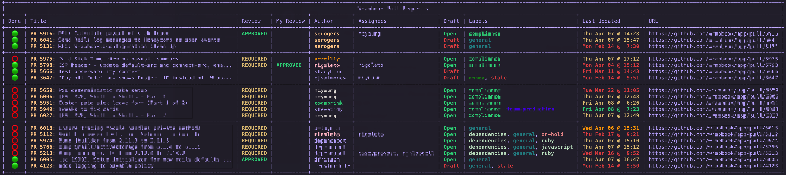

# Bonanza - A Fancy Pull Request Dashboard 🎊

Get productive with Github's pull request list! Github has [some handy search filters](https://docs.github.com/en/issues/tracking-your-work-with-issues/filtering-and-searching-issues-and-pull-requests) for their Pull Request list, but sometimes you need more flexibility. For example, Github's search does not allow for `OR` operations, only `AND`. If you want to see several searches in one dashboard, you've come to the right place!



## Installation

1. Install the [Github CLI](https://cli.github.com) and login to your account
2. Clone this prepository to somwhere comfy
3. Install script dependencies: `bundle install`
4. Create a `.bonanza_conf.yml` file in each repo you want to render a dashboard (see format below)
5. Add `.bonanza_conf.yml` to your `gitignore_global` file, or to each repo 
6. Add a shell alias for quick execution: `alias bonanza="ruby PATH_TO_REPO/bonanza/lib/bonanza.rb`

## Configuration

```yml
gh_handle: [Your GH Handle]

# Search queries sent to Github CLI (two included by default, see FAQ)
searches:
  - --label critical
  - --label general
  - --search review:required

search_limit: 20 # default

# Optionally colorize authors
author_colors:
  [GH Handle]: green
  [GH Handle]: blue
  [GH Handle]: "#e6e1dc"

# Optionally override label colors
label_colors:
  critical: red
  stale: gray
```

## Running Bonanza

Change to your project's directory, and run `bonanza` (or the alias you chose) to see the dashboard.

## FAQ

**What are the different dashboard sections?**

Each "search" generates a new section. Currently there are two default searches that show first:
- Pull requests authored by you
- Pull involving you (as defined by Github - assigned, commented, etc.)

**What is the "Done" column?**

This is used to signify whether a pull request needs your attention. For example, once you've reviewed a pull request, it's "Done".

**What do the colors in "Last Updated" mean?

- Within the hour: Green
- Within a day:    Yellow
- Withing 3 days:  Orange
- Anything older:  Red

**Is this production ready?**

This is a script created based on a personal need. Use at your own risk!

**I've got an idea, how to contribute?**

Open a pull request or issue!
