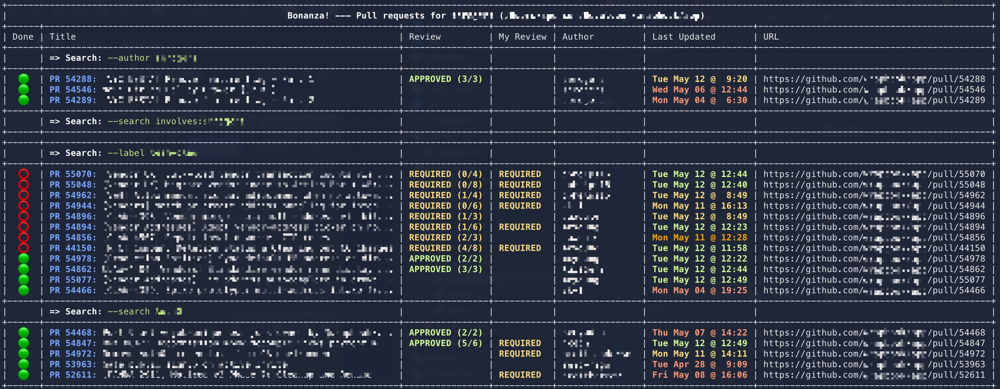

# Bonanza - A Fancy Pull Request Dashboard 🎊

Get productive with Github's pull request list! Github has [some handy search filters](https://docs.github.com/en/issues/tracking-your-work-with-issues/filtering-and-searching-issues-and-pull-requests) for their Pull Request list, but sometimes you need more flexibility. For example, Github's search does not allow for `OR` operations, only `AND`. If you want to see several searches in one dashboard, you've come to the right place!



## Installation

1. Install the [Github CLI](https://cli.github.com) and login to your account
2. Clone this prepository to somwhere comfy
3. Install script dependencies: `bundle install`
4. Create a `.bonanza.yml` file in each repo you want to render a dashboard (see format below)
5. Add `.bonanza.yml` to your `gitignore_global` file, or to each repo
6. Add the bonanza executable to your shell path: `PATH=$PATH:PATH_TO_REPO/bonanza/bin/bonanza`

## Configuration

```yml
# Place in project directory: .bonanza.yml

gh_handle: [Your GH Handle]

# Search queries sent to Github CLI (two included by default, see FAQ)
searches:
  - --label critical
  - --label general
  - --search review:required

search_limit: 20 # default

# Optionally colorize authors
author_colors:
  [GH Handle]: green
  [GH Handle]: blue
  [GH Handle]: "#e6e1dc"

# Optionally override label colors
label_colors:
  critical: red
  stale: gray
```

## Running Bonanza

Change to your project's directory, and run `bonanza` (or the alias you chose) to see the dashboard.

## Testing

The test suite uses [minitest](https://github.com/minitest/minitest) and lives in `test/`.

```sh
bundle install
bundle exec rake test
```

Layout:
- `test/test_helper.rb` — boots a minimal `Bonanza` module
- `test/fixtures/` — fixtures used by tests
- `test/bonanza/` — mirrors `lib/bonanza/`, one `*_test.rb` per class

By default each test boots `Bonanza.config` from the fixture `.bonanza.yml`. To override values for a single test, wrap the assertion in `with_config`:

```ruby
with_config("author_colors" => { "monalisa" => :red }) do
  # Bonanza.config.author_colors is { "monalisa" => :red } in here
end
```

To capture a fresh fixture from a real repo:

```sh
cd /path/to/repo
PAGER=cat gh pr list --state open --limit 5 \
  --json title,reviewDecision,latestReviews,number,author,assignees,isDraft,labels,updatedAt,url \
  > /path/to/bonanza/test/fixtures/<name>.json
```

## FAQ

**What are the different dashboard sections?**

Each "search" generates a new section. Currently there are two default searches that show first:
- Pull requests authored by you
- Pull involving you (as defined by Github - assigned, commented, etc.)

**What is the "Done" column?**

This is used to signify whether a pull request needs your attention. For example, once you've reviewed a pull request, it's "Done".

**What do the colors in "Last Updated" mean?**

- Within the hour: Green
- Within a day:    Yellow
- Within 3 days:   Orange
- Anything older:  Red

**Is this production ready?**

This utility was created to fulfill a personal need. As such, the implementation and tests cover my use cases. However it should be safe to use (though at your own risk).

**I've got an idea, how to contribute?**

Open a pull request or issue! Or fork and go crazy.
